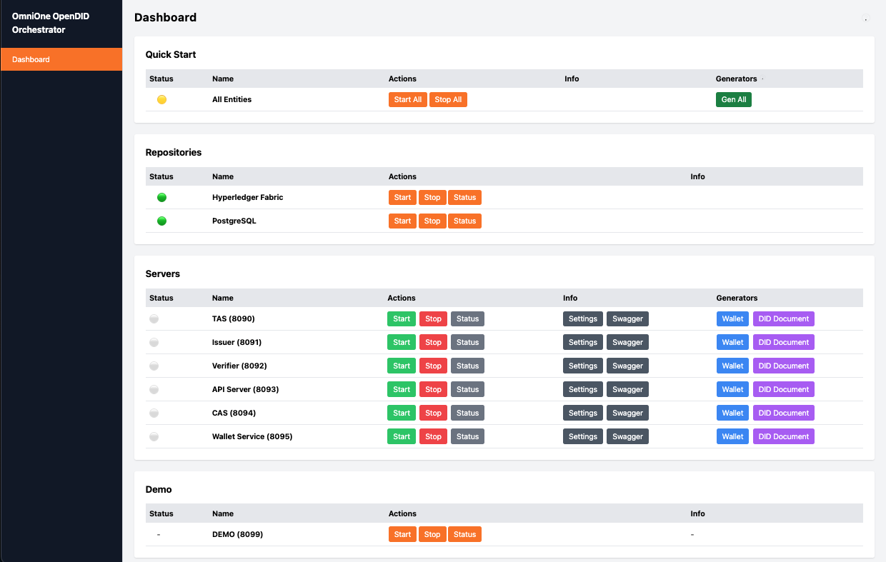

# Orchestrator 사용자 매뉴얼

## 개요
`Orchestrator`는 **서버 통합 관리 콘솔**로, 여러 서버의 상태를 확인하고 제어할 수 있는 기능을 제공 합니다.
본 문서는 Orchestrator의 화면 구성 및 기능에 대한 설명을 포함하고 있습니다.

## 1. 접속 방법
- 웹 브라우저에서 `http://<서버 IP>:<9001>` 로 접속합니다.
- 초기 화면에서 전체 서버의 상태를 확인할 수 있습니다.

## 2. 화면 구성
Orchestrator 화면은 다음과 같은 주요 영역으로 구성됩니다.

### 2.1 Quick Start
전체 엔티티에 대한 **시작(Start All), 종료(Stop All)** 기능을 제공합니다.

- **All Entities**
  - 상태 아이콘:  
    - 🟢 모든 서버가 실행 중  
    - 🟡 일부 서버 실행 중  
    - 🔴 모든 서버 중지됨  

  - `Start All`: 전체 엔티티를 시작합니다.
  - `Stop All`: 전체 엔티티를 종료합니다.

### 2.2 Repositories
각 서버별로 **시작(Start), 종료(Stop), 상태 확인(Status)** 기능을 제공합니다.

- **Hyperledger Fabric**
  - 상태 아이콘: 🟢 (실행 중) / 🔴 (중지됨)
  - `Start`: Hyperledger Fabric을 시작합니다.
  - `Stop`: Hyperledger Fabric을 종료합니다.
  - `Status`: Hyperledger Fabric의 상태를 확인합니다.

- **PostgreSQL**
  - 상태 아이콘: 🟢 (실행 중) / 🔴 (중지됨)
  - `Start`: PostgreSQL를 시작합니다.
  - `Stop`: PostgreSQL를 종료합니다.
  - `Status`: PostgreSQL 상태를 확인합니다.

### 2.3 Servers
각 서버별로 **시작(Start), 종료(Stop), 상태 확인(Status)** 기능을 제공합니다.

- **개별 서버 관리**
  - 상태 아이콘: 🟢 (실행 중) / 🔴 (중지됨)
  - 각 서버의 포트 번호가 표시되며, `Start`, `Stop`, `Status` 버튼을 제공합니다.
  - `Settings`: 개별 서버 설정 페이지로 이동하는 버튼이 제공됩니다.

## 3. 주의사항
- `Start`, `Stop` 버튼을 사용할 경우, 서버 실행 환경에 따라 일정 시간이 소요될 수 있습니다.
- 설정 페이지(`Settings` 버튼)를 통해 개별 서버의 상세 설정을 조정할 수 있습니다.
